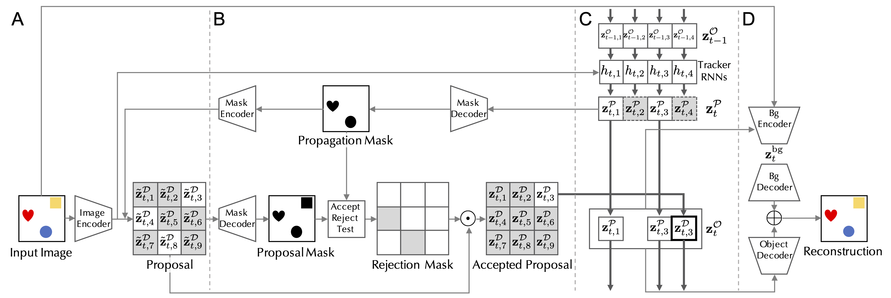

## SCALOR

This repository is the official implementation of ["SCALOR: Generative World Models with Scalable Object Representations"](https://arxiv.org/abs/1910.02384) by [Jindong Jiang](https://www.jindongjiang.me)\*, [Sepehr Janghorbani](http://janghorbani.net)\*, [Gerard de Melo](http://gerard.demelo.org), and [Sungjin Ahn](https://sungjinahn.com/); accepted at the *International Conference on Learning Representations* (*ICLR*) 2020. [Project Website](https://sites.google.com/view/scalor/home)




## Requirements

To install requirements:

```bash
conda env create -f environment.yml
```

To activate:

```bash
conda activate scalor_env
```

## Dataset

The "Grand Central Station" dataset can be downloaded [here](https://bit.ly/36tckTa). After downloading the file, extract the dataset using this command:

```bash
tar -xf grandcentralframes.tar.gz -C /path/to/dataset/
```


## Training

To train SCALOR with default settings, run this command:

```bash
python train.py --data-dir /path/to/dataset/
```


## Results


## Citation

```
@inproceedings{JiangJanghorbaniDeMeloAhn2020SCALOR,
  title={SCALOR: Generative World Models with Scalable Object Representations},
  author={Jindong Jiang and Sepehr Janghorbani and Gerard {de Melo} and Sungjin Ahn},
  booktitle={Proceedings of ICLR 2020},
  year={2020},
  publisher = {OpenReview.net},
  location = {Addis Ababa, Ethiopia},
  url = {https://openreview.net/pdf?id=SJxrKgStDH},
}
```

